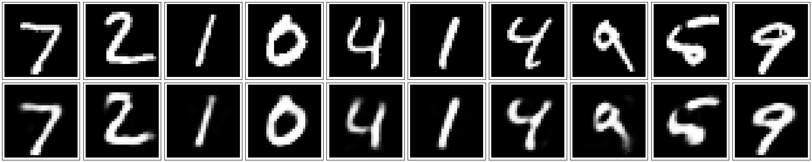
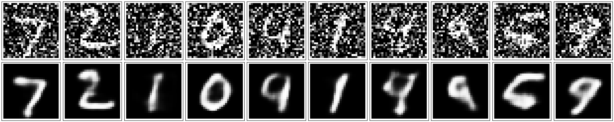

This project demonstrates that autodecoder can be used for compressing images and denoising images.

For the simple version, the encoder and decoder each use a fully connected layer. The input is a 784 length vector and the compressed version (number of hidden layer nodes) is a 32 length vector.

The original images and their reconstructed images are shown below.

For the convolutional version, the encoder and decoder each contain three convolutional layers and three pooling layers. Random noise is added to the input to train the network to denoise images. The trained network performance is shown below with the first row as the noisy images and second row as the denoised images.

