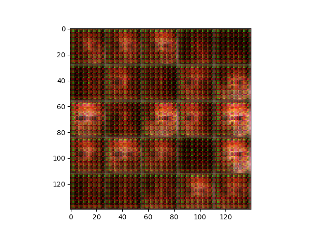
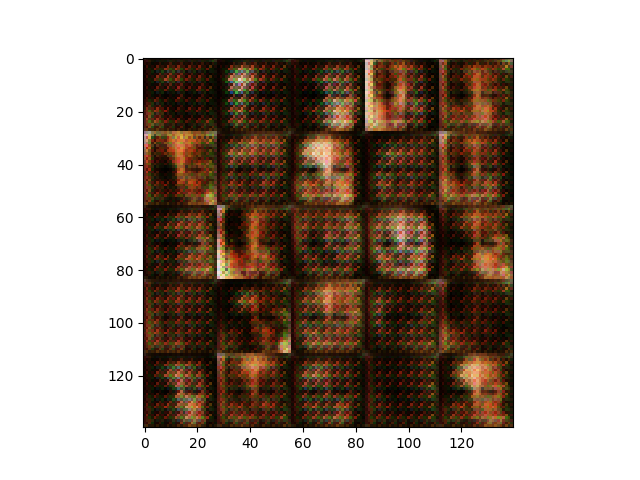
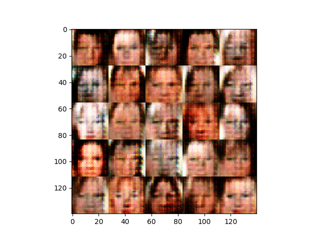
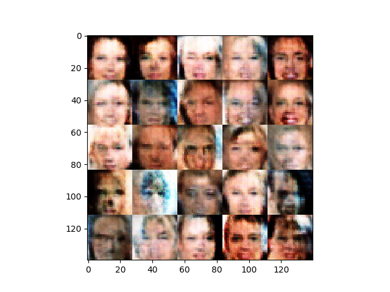
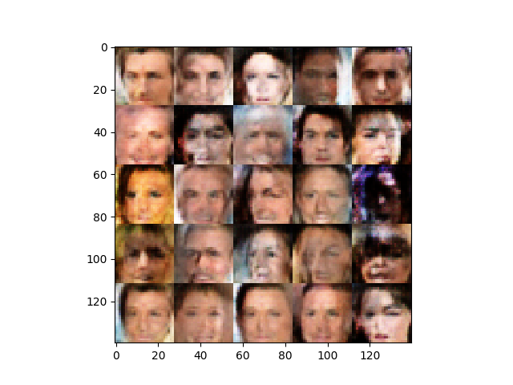
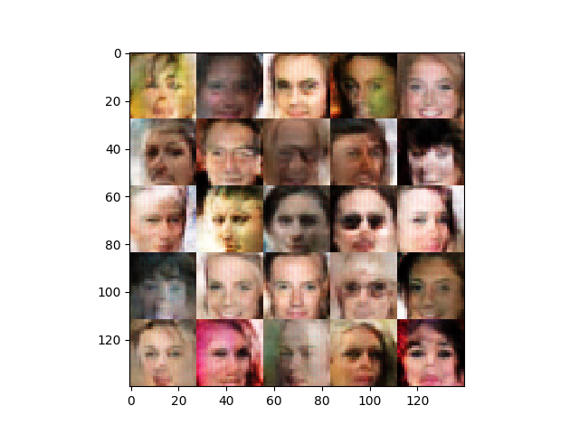
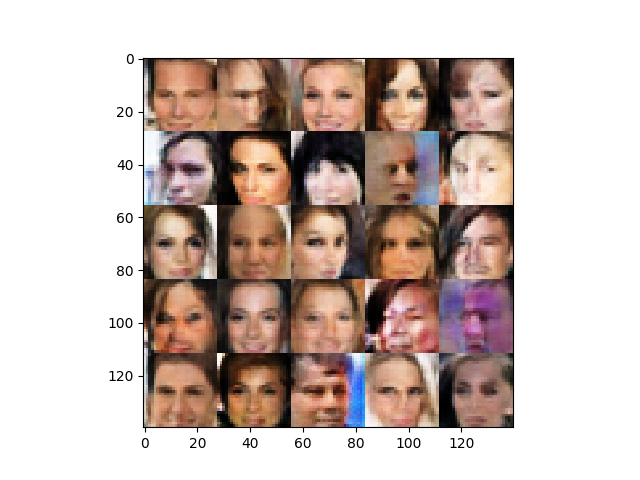
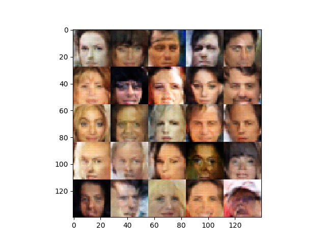

This project is a GAN that generates faces. The training set is 262K celebrity faces. The generator and the discriminator each include three convolutional layers with Leaky RELUs as activation functions. The generator's output layer is a transpose convolutional layer to upsample the image. The discriminator's convolutional layers are connected with a dense layer as output. 

Here are some examples of images generated by the network:

After 100 batches:

After 200 batches:

After 500 batches:

After 1000 batches:

After 2000 batches:

After 3000 batches:

After 4000 batches:

After 5000 batches:

