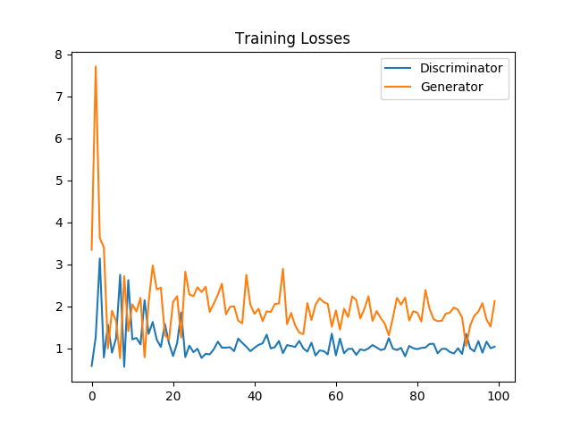
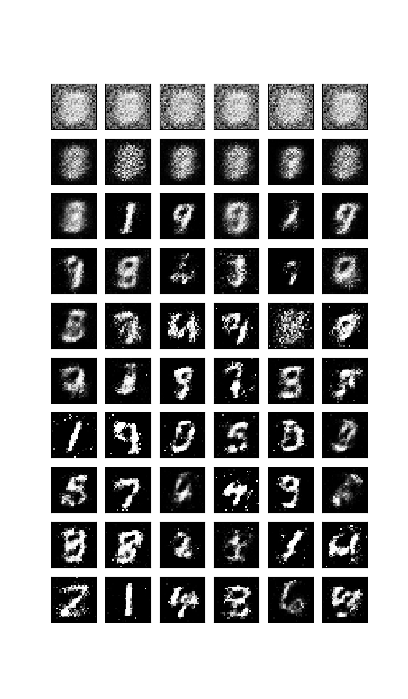

This project is a GAN that generates new handwritten digit images similar to the ones in MNIST dataset. The generator has one hidden layer of 128 nodes followed by a leaky RELU. The discriminator also has one hidden layer of 128 nodes followed by a leaky RELU. 

This plot shows the generator/discriminator losses in the training process.

This plot shows the sample outputs in the training process. As the training progresses, better quality images are generated.

